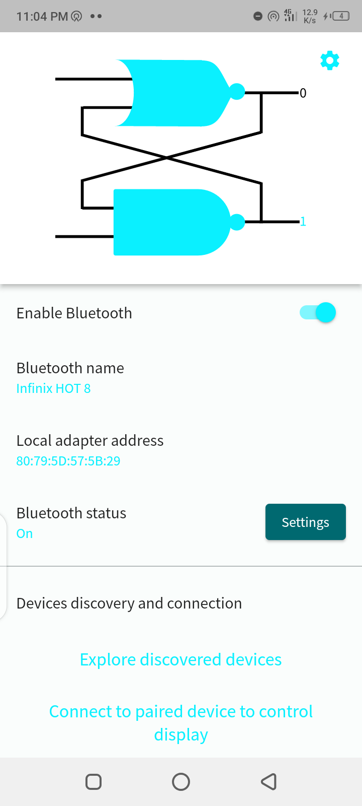
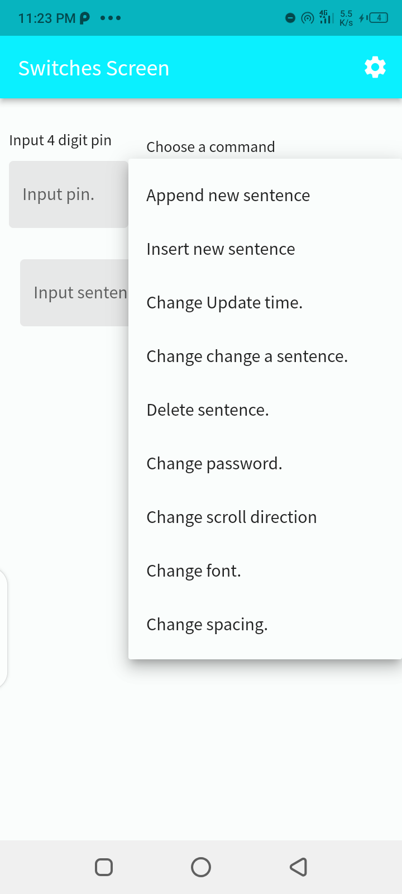
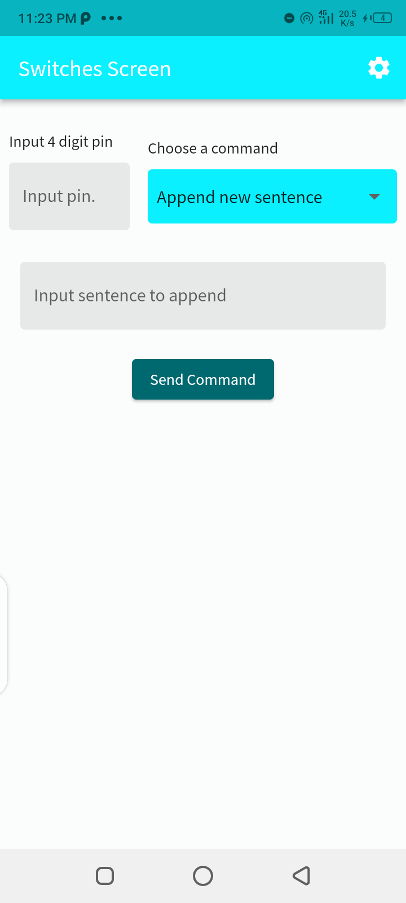
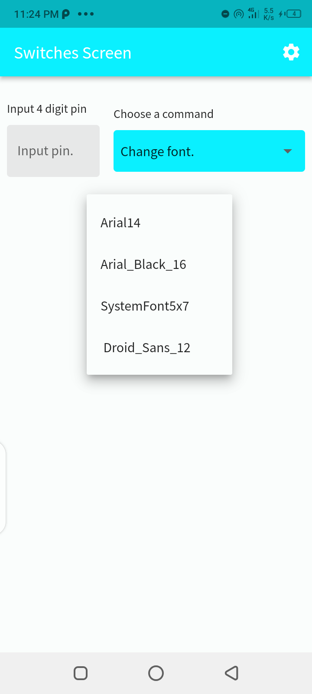

# Switches Display

## Description

Switches Display is a mobile application developed with Flutter that allows users to control a programmable display via Bluetooth. The display is powered by an Arduino Nano microcontroller and features a P10 DMD display. The mobile app communicates with the display using a Bluetooth HC-06 module, enabling users to send commands and update the content shown on the display wirelessly.

This README provides an overview of the application's features, installation instructions, and usage guidelines.

## Features

- Control the programmable display wirelessly from your mobile device.
- Send custom text and graphic commands to be displayed on the P10 DMD screen.
- User-friendly interface for a seamless interaction with the display.
- Easy integration with other Arduino projects.
- From the app, you add, insert, change and delete text to be displayed.
- Also, the font, spacing between letters, scroll direction can be changed.

5. You can also restrict the access to control the display by setting a 4 digit pin.

## Technologies Used

- Flutter (Mobile app development framework)
- Arduino Nano (Microcontroller)
- P10 DMD Display
- Bluetooth HC-06 Module

## Screenshots

  

